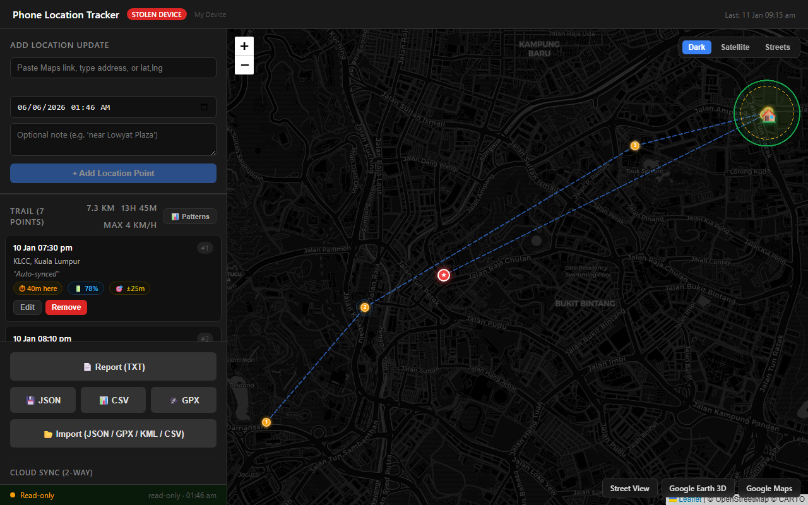
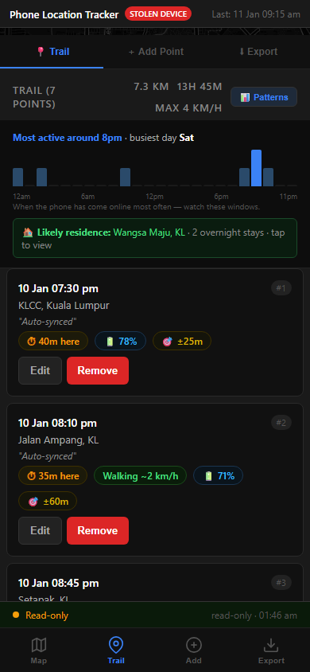
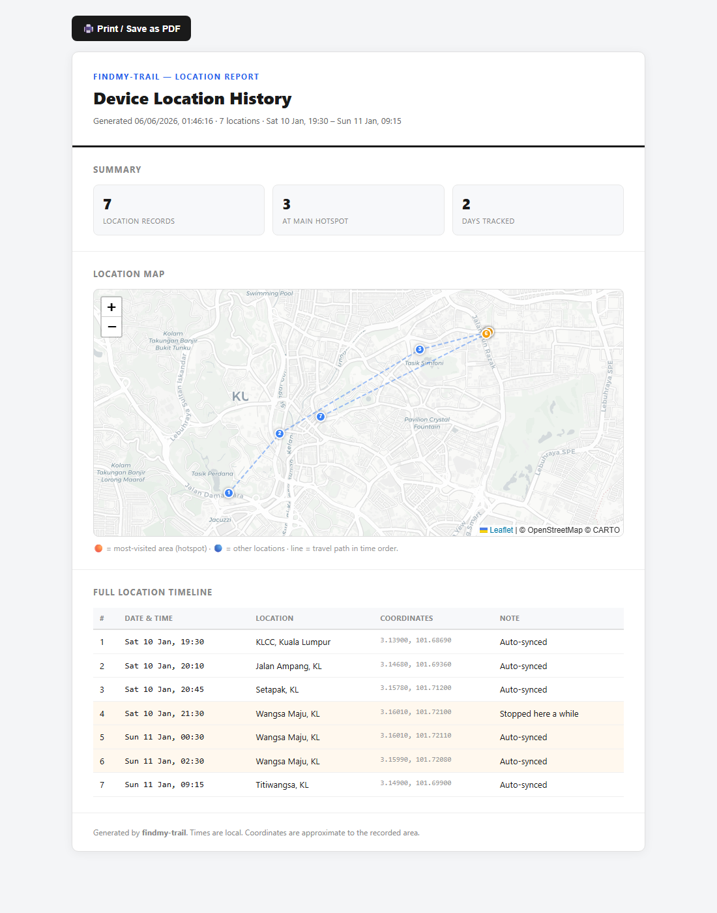

# findmy-trail

[](LICENSE.md)
[](https://github.com/FixITSukil/findmy-trail/stargazers)
[](https://www.fixitsukil.com/findmy-trail)
[](https://fixitsukil.github.io/findmy-trail/tracker.html?demo=1)
[](CONTRIBUTING.md)

**Turn a string of "last known location" pings into a readable map, a movement
pattern, and a shareable report — for the device *you own*.**

🌐 **Website:** [fixitsukil.com/findmy-trail](https://www.fixitsukil.com/findmy-trail) · ▶️ **Live demo:** [try it in your browser](https://fixitsukil.github.io/findmy-trail/tracker.html?demo=1)

When a phone is lost or stolen, Apple Find My only shows you a single pin that
jumps around every 10–30 minutes. `findmy-trail` records each of those pings,
draws the **trail over time**, finds the **hotspots** the device keeps returning
to, flags a **likely overnight base**, alerts you the moment the device comes
back **online**, and exports a clean **report** you can hand to police.

It was built during a real recovery — and it worked.

---

## ⚠️ Ethical & legal use

This tool is for locating **your own devices** through **your own Apple ID**, or
devices you are **explicitly authorised** to locate. Using it to track another
person without their knowledge and consent is very likely **illegal** (stalking,
harassment, privacy violations) in most countries. **Don't.** You are solely
responsible for how you use it.

---

## 📸 Screenshots

> Add your own clean screenshots (use the app with `sample-locations.json` — **never** real data) into the `docs/` folder, then they'll show here.

| Trail map | Mobile + patterns | Printable report |
|---|---|---|
|  |  |  |

## ✨ Features

- 🗺️ **Trail map** — every location pin connected in time order (dark / satellite / streets)
- 📍 **Manual + automatic logging** — paste a Maps link / address, or let `sync.py` pull from iCloud
- ☁️ **Optional 2-way cloud sync** — phone and laptop stay in sync via your own private GitHub repo
- 🔥 **Hotspot detection** — highlights where the device dwells or keeps returning
- 🏠 **Home-base detection** — flags the strongest overnight (12am–6am) cluster
- 🚨 **Live-catch alerts** — push notification (via [ntfy](https://ntfy.sh)) + in-app banner the instant the device comes online
- 🔋 **Battery, charging state & GPS accuracy** captured per ping
- 📊 **Activity patterns** — when the device is most often online
- 📄 **Printable report** (`report.html`) — device details, map, full timeline → save as PDF
- 🔁 **Import / export** — JSON, **GPX**, **KML**, and **CSV** (works with Google Timeline, GPS apps, spreadsheets)
- 📱 **Mobile-first UI** + PIN lock for hosted use

## 🚀 Quick start (manual, no setup)

1. Open `tracker.html` in any browser.
2. Edit the `CONFIG` block at the top of the `<script>` (device details, PIN).
3. Each time Find My updates, paste the address or Google Maps link → **Add Location Point**.
4. Watch the trail, hotspots, and patterns build up.

## 🤖 Automatic logging from iCloud (optional)

```bash
pip install pyicloud
python sync.py
```

It will ask for the Apple ID that owns the device, handle 2FA, let you pick the
device, then poll every 10 minutes and serve the tracker at
`http://localhost:8080/tracker.html`.

> Note: `sync.py` uses the unofficial `pyicloud` library. Apple may change their
> API at any time. While a device is **powered off**, Apple does not expose the
> offline-network location, so automatic pulls only work while it's on.

## ☁️ Cloud sync + alerts (optional)

Set these as environment variables (or edit the defaults in `sync.py` and the
`CONFIG.cloud` block in `tracker.html`):

| Variable | Purpose |
|---|---|
| `GH_OWNER` / `GH_REPO` | **Your own private** repo that holds `locations.json` |
| `NTFY_TOPIC` | A hard-to-guess [ntfy.sh](https://ntfy.sh) topic; subscribe in the ntfy app for online alerts |

Create a **fine-grained GitHub token** (Contents: Read & write on that repo),
paste it into the app once (Export → Cloud Sync) and into `sync.py` when prompted.
The token is stored locally only and is **gitignored**.

## 📄 The report

Open `report.html` — it reads your `locations.json` and renders a clean,
printable document (device info, map, hotspot, full timeline). Use your
browser's **Print → Save as PDF**.

## 🗂️ Files

| File | What it is |
|---|---|
| `tracker.html` | The main interactive app (self-contained) |
| `sync.py` | Optional iCloud auto-sync + local server + alerts |
| `report.html` | Printable evidence/report generator |
| `locations.json` | Your trail data (starts empty; see `sample-locations.json`) |

## 🔒 Privacy

Everything runs on your machine. Data only leaves your device if **you** enable
cloud sync to **your own** GitHub repo. Credentials and tokens are gitignored.
Never commit your real `locations.json`.

## 🤝 Contributing

Contributions are welcome — see [CONTRIBUTING.md](CONTRIBUTING.md). Note the
licensing model below before contributing.

## 📜 License

**Source-available, non-commercial** — see [LICENSE.md](LICENSE.md)
([PolyForm Noncommercial 1.0.0](https://polyformproject.org/licenses/noncommercial/1.0.0/)).

You may use, modify, and share this freely for any **non-commercial** purpose.
**Commercial use — including selling or licensing to commercial or government
entities — is reserved to the copyright holder.** For a commercial license,
open an issue or contact the maintainer.

Copyright © 2026 Sukil ([@FixITSukil](https://github.com/FixITSukil)).
